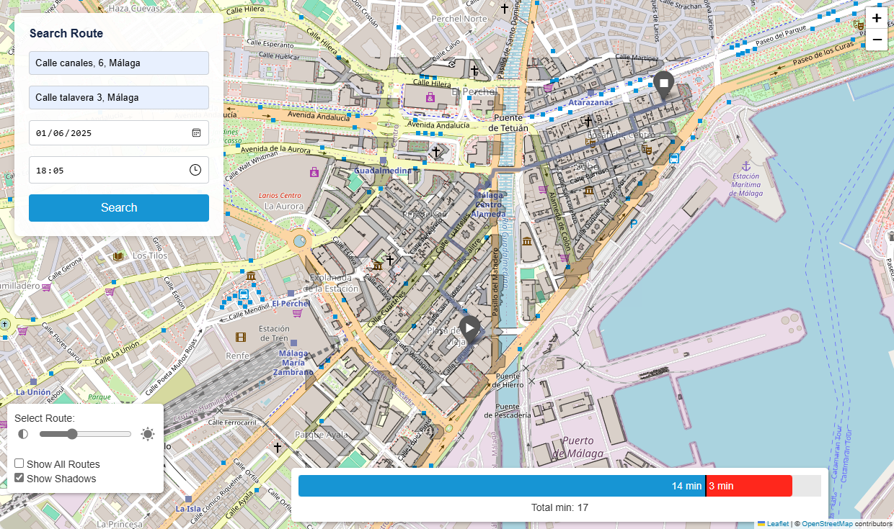
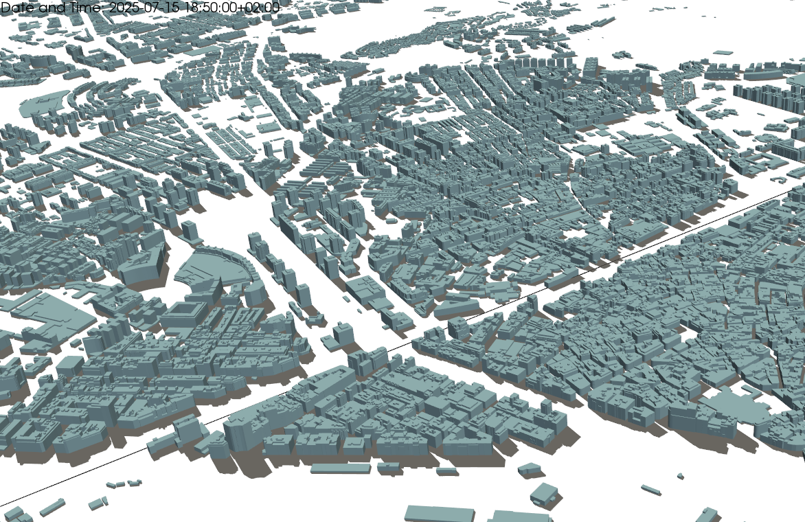

# Street Shadow
Street Shadow is an advanced Python-based geospatial application designed to analyze urban environments by leveraging 3D building data. It processes geospatial datasets to compute accurate shadow projections, enabling the generation of optimized pedestrian routes that balance sunlight exposure and shadow coverage. The application integrates cutting-edge technologies to visualize results through interactive maps, providing users with an intuitive and engaging experience.

By combining solar position calculations, shadow modeling, and route optimization, Street Shadow offers a comprehensive solution for urban planners, researchers, and individuals seeking to navigate cities with a focus on solar radiation protection. Its modular architecture and web-based interface make it accessible for a wide range of use cases, from academic research to practical urban mobility applications.

## Routing Algorithm
Street Shadow employs the Dijkstra's algorithm to compute optimal routes. The algorithm is enhanced to consider a set of weights that balance between shorter routes with higher sun exposure and longer routes with reduced sun exposure. This approach allows users to prioritize their preferences for sunlight exposure versus travel distance.

### Weighted Graphs
The routing process uses preprocessed graphs where each edge has multiple weight columns. These weights are calculated based on a parameter `alpha`, which ranges from 0.0 to 1.0:
- **`alpha = 0.0`**: Prioritizes routes with minimal sun exposure, regardless of distance.
- **`alpha = 1.0`**: Prioritizes the shortest route, ignoring sun exposure.
- **Intermediate values of `alpha`**: Provide a balance between distance and sun exposure.

### Algorithm Steps
1. **Graph Selection**: The algorithm selects the preprocessed graph corresponding to the current sun vector.
2. **Weight Column Selection**: Based on the user-defined `alpha` value, the appropriate weight column is chosen for routing.
3. **Dijkstra's Algorithm**: The algorithm computes the path with the minimum weight using the selected weight column.
4. **Route Metrics**: The computed routes are evaluated to provide detailed metrics, including total distance, travel time, and the proportion of the route exposed to sunlight versus shadow. These metrics enable users to make informed decisions by comparing routes based on their preferences for sunlight exposure and travel efficiency.

This flexible approach enables users to customize their routes based on their desired balance between sunlight exposure and travel efficiency.

## Features
- **Building Processing:** Converts 3D building models (from GML files) into meshes and footprints.
- **Shadow Calculation:** Projects building meshes onto the ground to compute dynamic shadows.
- **Route Generation:** Computes optimal routes considering sunlight and shadow factors.
- **Interactive Mapping:** Generates dynamic maps using Folium and Leaflet to display routes and shadow overlays.
- **Web Interface:** Provides a Flask-based web app for route search and real-time visualization.

*Screenshot of the web interface showing shadow-optimized routes.*
<div align="center">
    
</div>

<br>

*Example of 3D building model with projected shadows.*
<div align="center">
    
</div>

## Demo
Here is a short demo showing how Street Shadow works:

<div align="center">
    <video controls style="max-width: 100%; width: 60%">
        <source src="assets/readme_media/demo_app.mp4" type="video/mp4">
    </video>
</div>

## Requirements
- Python (version 3.11.9 was used during development; other versions have not been tested)
- NumPy
- Pandas
- GeoPandas
- Folium
- PyVista
- PyProj
- Shapely
- Flask
- Pvlib
- Others (see [requirements.txt](requirements.txt))

## Project Structure

- **`app/`**: Contains the web application backend and HTML templates. Includes the script to launch the Flask-based web app.
- **`assets/`**: Contains static files such as images, videos, and frontend scripts.
- **`modules/`**: Houses Python modules for solar calculations, shadow projections, routing, and visualization.
- **`data/`**(Not include in the repository): Stores raw and processed data, including GML files, graphs (routes), GeoJSON files (shadows), sun vectors, and more.
- **`output_examples/`**: Contains an HTML sample showcasing a set of generated routes.

The main scrips are found in the root folder:
- **`main_get_all_vectors.py`**: Calculates solar vectors over a specified time range.
- **`main_get_routes.py`**: Generates optimal routes based on shadow data and user-defined parameters.
- **`main_getGMLFromRef.py`**: Downloads and processes GML building data from a reference.
- **`main_gml_2_3D.py`**: Converts GML files into 3D building models and generates essential output files.
- **`main_process_graphs.py`**: Processes and enriches street network graphs with shadow data.
- **`main_process_shadows.py`**: Computes shadow projections for each solar vector and generates GeoJSON files.

## License

This project is licensed under the GNU General Public License v3. See the [LICENSE](LICENSE) file for more details.

## Contributing
Contributions are welcome! Feel free to open issues or submit pull requests with improvements.

## Acknowledgments
Special thanks to the open-source community and the developers of the libraries used in this project. Before acknowledging those who played a key role in making Street Shadow a reality, we express our heartfelt gratitude to everyone whose support, insights, and resources have been indispensable along this journey.

**José Aguilera Arjona**  
For his extensive support in determining the optimal approach for calculating the sun's position, serving as the original inspiration for this project, and for his efforts in raising awareness about solar radiation protection.

**Ezequiel López Rubio**  
For contributing essential computational resources (via the Picasso supercomputer at the University of Málaga and the SCBI), which were critical for the project's development.

**Carlos Luis Sánchez Bocanegra** and **Samuel Paul Gallegos Serrano**  
For their invaluable mentorship and guidance, which enriched the project with their expertise and were instrumental in its success.

```
The author thankfully acknowledges the computer resources (Picasso Supercomputer), technical expertise and assistance provided by the SCBI (Supercomputing and Bioinformatics) center of the University of Malaga
```

# How replicate the project
## 1. Installation
1. **Clone the repository:**
   ```bash
   git clone https://github.com/jlgonrod/street_shadow.git
   cd street_shadow
   ```

2. **Install dependencies:**
   ```bash
    pip install -r requirements.txt
   ```
## 2. Download GML Building Data by Municipality
Street Shadow requires 3D building data in GML format, obtained from the Spanish Cadastre's INSPIRE service. These data contain the building footprints and number of floors necessary to calculate shadow projections.

1. **Access the INSPIRE Cadastre Portal:**<br>
Go to [https://www.catastro.hacienda.gob.es/webinspire/index.html](https://www.catastro.hacienda.gob.es/webinspire/index.html)

2. **Access the ATOM Service for BuildingPart:**<br>
Visit the following link to download the GML data for your municipality:  
[https://www.catastro.hacienda.gob.es/INSPIRE/buildings/ES.SDGC.BU.atom.xml](https://www.catastro.hacienda.gob.es/INSPIRE/buildings/ES.SDGC.BU.atom.xml)

3. **Download the data for the municipality**:  
Locate the municipality for which you want to download building data. Once found, navigate to the corresponding ATOM feed and download the GML file.

    > For example, to download the GML building data for Málaga (municipality 29900), you can access the following link:  
    > [http://www.catastro.hacienda.gob.es/INSPIRE/buildings/29/ES.SDGC.bu.atom_29.xml](http://www.catastro.hacienda.gob.es/INSPIRE/buildings/29/ES.SDGC.bu.atom_29.xml)  
    
    Once there, locate the specific `.zip` file for your municipality and download it. In our example:  
    > [http://www.catastro.hacienda.gob.es/INSPIRE/Buildings/29/29900-MALAGA/A.ES.SDGC.BU.29900.zip](http://www.catastro.hacienda.gob.es/INSPIRE/Buildings/29/29900-MALAGA/A.ES.SDGC.BU.29900.zip)  
    
    Unzip the file and keep the file ending in "buildingpart.gml". In our example:  
    > `A.ES.SDGC.BU.29900.buildingpart.gml`

4. **Setting Up the GML Data Folder Structure**:  
In the project’s root directory, create a folder named `📁data`. Inside the data folder, create a subfolder `📁gml/town`. Then, save the file buildingpart.gml in that subfolder and rename it with the city name. So that its path is:
    > `street_shadow/data/gml/town/malaga.gml`

## 3. Preprocessing GML Files
Before running the full application, you must execute the script `main_gml_2_3D.py` at least once. This script processes the GML file and generates essential output files, such as `combined_mesh.vtk`, which are required for the application to function properly.

To ensure the script runs correctly:
1. Set the appropriate city name in the script's variable to match the `buildingpart.gml` file location.
2. Specify a datetime value (this value is not critical for this preprocessing step).

Once executed, the script will prepare the necessary data for the application to function and will save three files in `📁street_shadow/data/processed_files`: two `.pkl` files and one `.vtk` file.

Make sure the GML file exists at the specified location before running the script.

> [!NOTE]  
> Running the scripts and processing the data can be computationally intensive, particularly for large datasets or extended time ranges. Ensure that your system has adequate resources (CPU, memory, and storage) to perform these computations efficiently.

## 4. Preprocessing the Sun Vectors

After generating the three essential files for the target city by running `main_gml_2_3D.py`, the next step is to calculate the solar vectors over the desired time range. This is done by executing the `main_get_all_vectors.py` script.

To proceed, follow these steps:
1. Set the city name in the `CITY` variable (e.g., `"malaga"`). The script uses this name to locate the corresponding processed files and the GML data from which the building coordinates were extracted.
2. Set the `EPSG_SOURCE` variable (e.g., `"EPSG:25830"`) to match the spatial reference system used in the GML file. This code is later used to convert the coordinates from the UTM system to EPSG:4326 (latitude, longitude), ensuring accurate solar position calculations.
3. Specify the start and end datetime of the period of interest using the `START_DATETIME` and `END_DATETIME` variables. Define the sampling frequency for solar vector calculations with the `FREQ` variable (e.g., `'5min'`).
4. The script calculates the sunrise and sunset times for each day within the specified time range and saves them in a CSV file. It also computes the solar vectors (defined by three components: x, y, z) at the given frequency, filters out duplicates, and removes vectors when the sun is below the horizon (vector `z < 0`).

This process generates two CSV files, which are saved in the folder `📁street_shadow/data/sun_vectors/<CITY>`.

## 5. Preprocessing the Shadows

After processing the solar vectors and generating the corresponding CSV files, the next step is to compute the shadows for each solar vector. This is achieved by running the `main_process_shadows.py` script.

1. The script reads the CSV file containing the solar vectors (with x, y, z coordinates) from the directory `📁street_shadow/data/sun_vectors/<CITY>`. Ensure the correct file name is specified.

2. Configure the following variables in the script:
    - `CITY`: The name of the city (e.g., `"malaga"`) to locate the processed files.
    - `EPSG_SOURCE`: The spatial reference system code used in the GML file (e.g., `"EPSG:25830"`).
    - `REMOVE_BASE`: A boolean parameter indicating whether to remove shadows from the base of the buildings. Set to `True` to exclude base shadows or `False` to include them.

3. The script performs the following tasks:
    - Iterates over each solar vector from the CSV file.
    - Loads the precomputed 3D building data.
    - Calculates the shadow projection on the ground for the current solar vector.
    - Generates shadow outputs (e.g., as GeoJSON files) for each solar position.

The generated shadow files in format `.geoJSON` are saved in the directory `📁street_shadow/data/processed_files/shadows_geojson/<CITY>`. These files can be used for visualization, further analysis, or routing.

## 6. Preprocessing the Graphs
A graph is a network where nodes represent intersections or key points and edges represent the connecting pathways (such as streets). In this project, we use the OSMnx library to download the base map graph from OpenStreetMap. The graphs preprocessing is handled for the script `main_process_graphs.py`

### 6.1 Download the Base Graph

The graph download process utilizes the OSMnx library to retrieve the base map of the city. To ensure the graph focuses on the area of interest, a custom polygon file can be used for a more targeted query. Follow these steps:

1. The polygon file should be a `pickle` file containing a Shapely `Polygon` object. For example:
    ```plaintext
    POLYGON ((-4.376163 36.717283, -4.44809 36.661534, -4.536324 36.712054, -4.4977 36.756765, -4.456673 36.751401, -4.384575 36.752639, -4.325695 36.730492, -4.331188 36.710541, -4.376163 36.717283))
    ```

2. Store the custom polygon file in a predefined directory within the project. For example, if working with the city "Málaga," the file should be saved at the following location:
    > `📁street_shadow/data/osmnx/malaga/malaga_polygon_geometry_to_query_graph.pkl`

3. In the same directory, ensure a file named `graph_base.pkl` is saved. This file contains the base graph and can be reused to avoid downloading the same data multiple times.

### 6.2 Generate Graphs for Each Shadow File
For every shadow geojson file generated in the previous steps, an enriched graph is created. This graph integrates the base street network with shadow data. This is done by `main_process_graph.py`

1. The program gathers all geojson shadow files and extracts the x, y, and z values from their filenames to identify which shadows have not yet been processed into a graph.

2. It then loads the list of existing graph files (using the same x, y, z values) and filters out any shadows that already have an associated graph.

3. The base graph is created or loaded using the OSMnx library, providing the street network for the target city.

4. For each shadow file without a corresponding graph, the base graph is processed with the shadow data from the geojson file. The function `process_graph_using_geojson` computes the shadow fraction for each edge and adjusts its weight.

5. New weight columns are computed for each edge based on different alpha values (ranging from 0.0 to 1.0 in 0.1 increments). The original length column is renamed to `weight_1.0`, resulting in 11 weight columns in total.

6. The enriched graph, now with all 11 weight columns, is saved for later routing computations that consider shadow influence.

Once processed, each enriched graph is saved as a separate file in the designated graphs directory (e.g., `📁street_shadow/data/osmnx/malaga/graph_0.951_-0.313_-0.213.pkl`). The file is named using the x, y, and z values extracted from the corresponding shadow file. These graph files provide a ready-to-use resource for optimizing routes under varying shadow conditions.

## 7. Route Generation
The route generation step uses the weighted graph enriched with shadow data to compute optimal routes that balance distance and shadow exposure. This process, implemented in `main_get_routes.py`, follows these steps:

1. The script calculates the sun vector for a given datetime and location, and it uses this vector to select the corresponding shadow geojson file.

2. It then checks if a weighted graph for the current sun vector already exists. If found, the graph is loaded; otherwise, the script builds the weighted graph by applying shadow fractions, calculating new edge weights for alpha values from 0.0 to 1.0 (in 0.1 increments), and creating 11 weight columns.  
    > [!NOTE]
    > Ensure that the shadow file associated with the sun vector exists in the directory `📁street_shadow/data/processed_files/shadows_geojson/<CITY>`. If the file is missing, the script will throw an error.

3. With the weighted graph ready, the script defines the origin and destination addresses.

4. The `calculate_routes` function computes optimal routes using the different weight columns. Duplicate routes are removed to ensure unique route options.

5. For each route, the script extracts the list of coordinates, calculates the total distance, and estimates travel times based on a user-defined speed.

6. Finally, all computed routes, along with their distances and travel times, are visualized on an interactive map, which is saved as an HTML file for easy review.

The generated routes provide a ready-to-use resource for optimizing pedestrian routing under varying shadow conditions. 
An example of the output generated can be found in [this sample map](/output_samples/map_with_routes.html).

## 8. Deploy a local server
The local server allows you to interact with the Street Shadow web application. Through the web interface, you can enter origin, destination, date, and time parameters to compute and visualize routes that balance distance and shadow exposure. The server will display an interactive map with the computed routes if the necessary data is present.

To deploy the server locally:

1. Go to the folder `📁street_shadow/app`
2. Run the Flask application `app.py`
3. Once the server starts, open your web browser and visit:
   ```bash
   http://127.0.0.1:5000/
   ```
4. Use the web form to input the desired origin, destination, and time parameters. The application will process your input and generate an interactive map with the computed routes.

If the required data (such as preprocessed GML files, sun vectors, shadow geojsons, or enriched graphs) is missing, the application will inform you with a clear error message. This feedback helps you identify and resolve any missing preprocessing steps.

Press Ctrl+C in the terminal to stop the server when finished.


